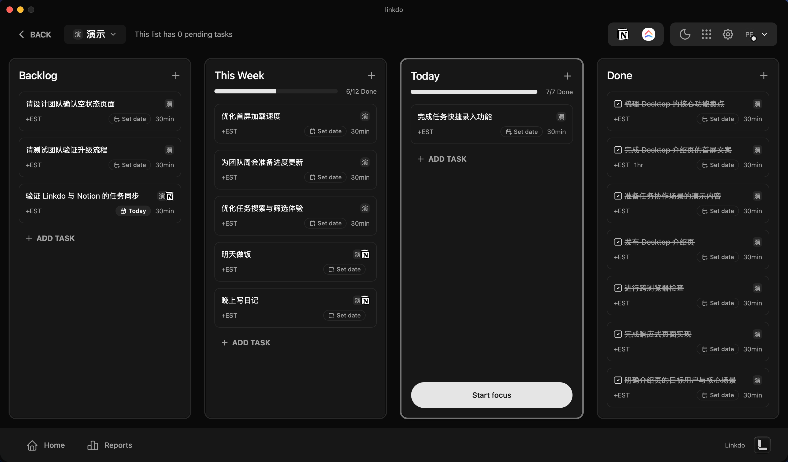
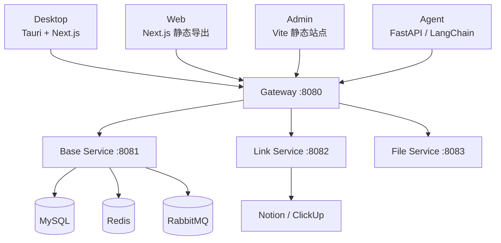

<div align="center">
  <h1>Linkdo</h1>
  <p>面向个人与团队的任务管理和专注工具。</p>
  <p>
    <a href="https://linkdo.a1ex.online/">🌐 访问项目官网与在线预览：linkdo.a1ex.online</a>
  </p>
  <p>
    <a href="https://github.com/A1ex-01/linkdo-monorepo/actions/workflows/desktop-package.yml">
      
    </a>
    
    
    
    
    
    
  </p>
  
</div>

## 架构概览



## 仓库结构

```text
apps/
  desktop/      Tauri 2 + Next.js 桌面客户端
  admin/        Vite + React 内部管理后台
  web/          Next.js 静态导出营销官网
packages/
  shared/       共享类型、常量与工具
  ui/           共享 React UI 组件与样式
services/
  backend/      Go 微服务后端
  agent/        Python FastAPI / LangChain Agent
deploy/         CCR 镜像与 Docker Compose 生产部署
docs/           架构、设计与实施文档
```

## 技术栈

| 范围 | 主要技术 |
| --- | --- |
| Desktop | Tauri 2、Next.js 15、React 19、Tailwind CSS |
| Admin | Vite、React 19、TanStack Router、Tailwind CSS、Radix/shadcn |
| Web | Next.js 16、React 19、Tailwind CSS；生产环境静态导出 |
| Backend | Go 1.26、Iris、GORM |
| Agent | Python 3.13+、FastAPI、LangChain |
| 基础设施 | MySQL、Redis、RabbitMQ、阿里云 OSS 与 Direct Mail |

## 前置条件

- Node.js `>=18`、pnpm `>=9`（项目使用 pnpm `10.33.0`）；
- Desktop 开发还需要 Rust 和 Tauri 所需的操作系统依赖；
- Go `1.26.1`；
- Python `>=3.13` 和 [uv](https://docs.astral.sh/uv/)；
- 本地启动后端还需要 MySQL、Redis、RabbitMQ，以及相应的服务配置。

## 快速开始

安装 JavaScript/TypeScript workspace 依赖：

```bash
pnpm install
```

启动所有 workspace 内的 JS/TS 开发脚本，或按应用单独启动：

```bash
# Desktop、Admin 与 Web
pnpm dev

# 单独启动
pnpm dev:desktop
pnpm dev:admin
pnpm dev:web
```

- Desktop 会启动 Tauri 原生窗口；
- Admin 使用 Vite 开发服务器；
- Web 默认监听 `http://localhost:6001`。

Backend 由 Gateway、Base、Link、File 服务与邮件 Worker 组成；Agent 也需要自身配置和外部依赖。因此它们不提供误导性的“单命令启动”入口。Gateway 的服务边界与本地运行说明见 [Gateway 文档](services/backend/gateway/README.md)。

## 应用与服务

| 模块 | 职责 | 技术 | 开发备注 |
| --- | --- | --- | --- |
| `apps/desktop` | 主产品桌面客户端：任务、看板、计时、集成、报告与 AI | Tauri 2 + Next.js | `pnpm dev:desktop` |
| `apps/admin` | 内部运营与开发管理后台 | Vite + React | `pnpm dev:admin` |
| `apps/web` | 产品官网与桌面端下载入口 | Next.js 静态导出 | `pnpm dev:web` |
| `services/backend` | 业务 API、第三方集成、文件和异步邮件处理 | Go 微服务 | Gateway 是唯一对外入口 `:8080`；Base、Link、File 服务与 Worker 独立运行 |
| `services/agent` | 基于自然语言的任务协作 Agent | FastAPI + LangChain | 通过 `BASE_SERVICE_URL` 与 Gateway 通信 |

## 质量检查与构建

在仓库根目录运行：

```bash
# Turbo workspace 任务
pnpm lint
pnpm typecheck
pnpm build

# Makefile 聚合检查
make lint
make typecheck
make format-check

# 单应用验证
pnpm --filter @linkdo/desktop test
pnpm --filter @linkdo/admin test
pnpm --filter @linkdo/web build
```

## 生产部署

Backend、Admin 与 Web 使用同一发布标签构建镜像，并由 Docker Compose 发布。Web 镜像只服务静态导出文件；容器内 Nginx 提供 HTTP，宿主机代理负责域名与 TLS。

环境文件、镜像推送、服务器发布、回滚、备份与反向代理边界见 [部署手册](deploy/README.md)。

## 文档索引

- [部署手册](deploy/README.md)
- [Backend Gateway](services/backend/gateway/README.md)
- [Web 静态部署设计](docs/superpowers/specs/2026-09-25-web-static-deployment-design.md)
- [Web 静态部署实施计划](docs/superpowers/plans/2026-09-25-web-static-deployment.md)

## 许可证

当前仓库根目录未声明许可证；未经项目维护者书面许可，请勿将其视为已授予开源使用权。
